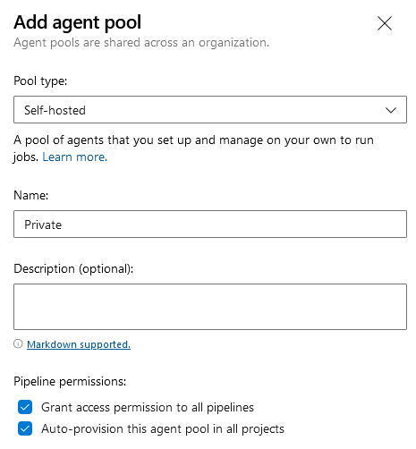
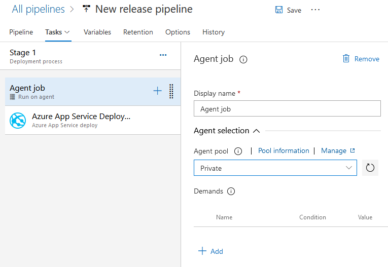

# Azure devops Private agent

New azure devops account no longer receive the free hosted agents to run jobs, these agents are necessary to run build pipelines to create artifacts and release pipelines to deploy these artifacts to the hosting environment.

New account can request free agents using [this](https://aka.ms/azpipelines-parallelism-request) form.

As long as you don't have access to a free agent you cannot run the created pipelines. An alternative to the free agents is using a self-hosted agent. The following instructions show how to add a self-hosted agent.

Go to the following url

```
https://dev.azure.com/{YOUR-ORGIZATION-NAME}/_settings/agentpools
```

Replace `{YOUR-ORGIZATION-NAME}` with your own orginization (most student chose their student number for this).

On this page you can create a new `agent pool` this is a collection of agents you can select for doing specific jobs in you pipelines.

Click `Add pool` on this page and for pool type select self-hosted as shown in the image below



Once you click the Create button the new pool should show up in list of agent pools, click it and should see the message `No jobs have run on this agent pool`. Click the `New Agent` button. This will open a dialog showing you instructions to install the agent on your device.

For windows you can simply download the zip extract it at a disired location open a powershell windows and change the directory to where files you just etrated are located.

open a new tab in your browser and open the following url.

```
https://dev.azure.com/{YOUR-ORGIZATION-NAME}/_usersSettings/tokens
```

Click `New Token` and under scopes select `Full access` and click `Create`. This will generate a access token that you will need to copy (warning this token has full access to your devops account).

run the following command in the shell.
```
.\config.cmd
```

Use `https://dev.azure.com/{YOUR-ORGIZATION-NAME}` for the server url.

Press enter to use your PAT token for authentication, and paste the token afterwards.

Next it asks for the Agent pool name, I used `Private` in the example when creating a new one so this is the name you should enter here as well.

The agent name is for you to know the agent refers to your own computer so enter a name and press enter again to go to the next question.

For next and last 3 question you can simply press enter.

Next to use this agent you need to run the next command.

```
.\run.cmd
```

you need to run this everytime if you want jobs to run on your agent.

if everthing went right you will see the agent as online in the agent list the agent pool page in devops (under the Agent tab)

Next you need to set your pipelines to use your agent pool.

if anything fails you can retry this in a administrator powershell.

for your build pipeline you to change the `pool` section from

```
pool:
  vmImage: ubuntu-latest
```

to

```
pool: {POOL-NAME}
```

Replacing `{POOL-NAME}` with the name of your agent pool (mine was `Private`)

a full sample of a build pipeline yaml file is shown below.

```
trigger:
- master

pool: Private

variables:
  BuildConfiguration: Release

steps:
- task: UseDotNet@2
  inputs:
    packageType: 'sdk'
    version: '5.0.x'
- task: DotNetCoreCLI@2
  inputs:
    command: 'test'
    projects: '**/*.csproj'
- task: DotNetCoreCLI@2
  inputs:
    command: 'publish'
    publishWebProjects: true
    arguments: '--configuration $(BuildConfiguration) --output $(build.artifactstagingdirectory)'
    zipAfterPublish: false
    modifyOutputPath: false
- task: PublishBuildArtifacts@1
  inputs:
    PathtoPublish: '$(Build.ArtifactStagingDirectory)'
    ArtifactName: 'drop'
    publishLocation: 'Container'
```

For the release you need to edit you release pipeline and click on the agent job inside the task list of your stage and set the agent pool to your create agent pool.

